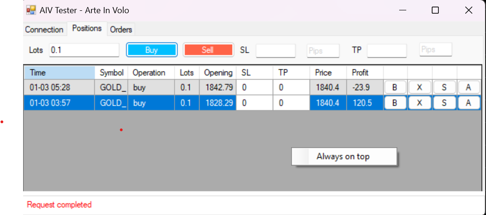

# MetaTrader 5 - Trading Panel

Trading panel that allows manual testing in MetaTrader 5 and simulate real time trading in testing mode, including setting different position volumes, stop losses, take profits, displaying open positions and pending orders. 
Also, this panel can be used as an alternative to the standard one provided with MT5 by default. 

# Preview

# CHANGE LOG
### 2023-06-30
1. fixed bug for hedging account
2. add "always on top" right click menu
3. add set SL/TP to all positions (same symbol, same direction), async mode
4. add close all positions (same symbol, same direction), async mode

### 2023-07-02
1. redesign UI

### 2023-07-03
1. add a textbox to showing current profit

# Links

- Using panel in a [Tester Mode](https://www.youtube.com/watch?v=shHEjUIRyj0)
- Using panel in a [Real Time](https://www.youtube.com/watch?v=Cyyy5sD7jqo)

